<!-- TOC depthFrom:1 depthTo:6 withLinks:1 updateOnSave:1 orderedList:0 -->

- [第12章-文件系统](#第12章-文件系统)
	- [MINIX文件系统](#minix文件系统)
	- [高速缓冲(磁盘高速缓冲)](#高速缓冲磁盘高速缓冲)
	- [文件底层操作](#文件底层操作)
	- [文件数据访问](#文件数据访问)
	- [文件高层访问](#文件高层访问)
	- [END](#end)

<!-- /TOC -->
# 第12章-文件系统

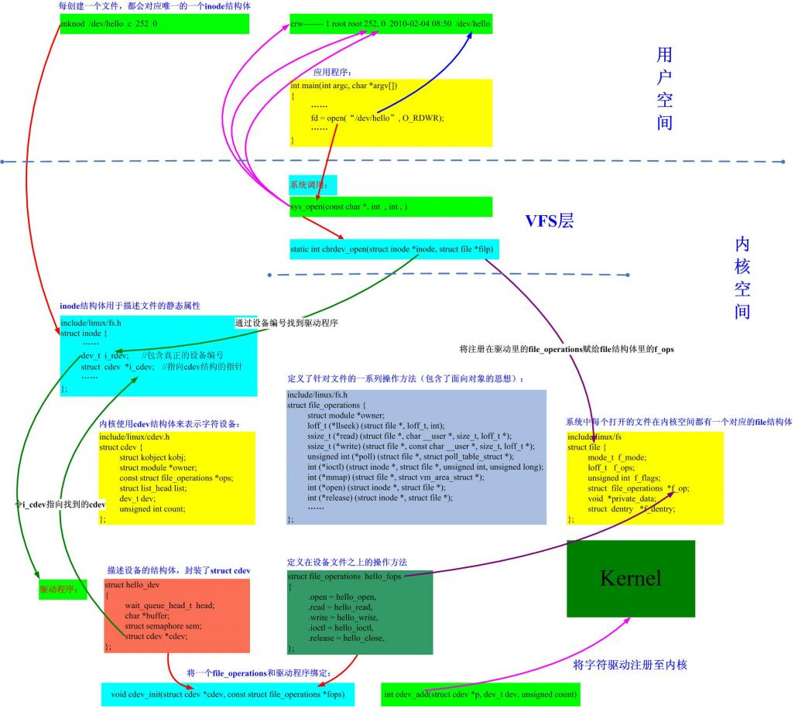

* 基于MINIX 1.0版本的文件系统，那个时候Linus还没有研发新文件系统，直接用MINIX的。
* 当编写原始Linux内核，Linus Torvalds需要一个文件系统，但是不想开发它。因此他简单的使用了Minix文件系统，这是 Andrew S. Tanenbaum开发的，而且是Tanenbaum 的Minix操作系统的一部分。Minix是类Unix操作系统，为教育使用而开发。它的代码开放使用，而且合理的授权给Torvalds，允许他将它用于Linux的初代版本。
* Ext也不是Linus研发。
* **Ext于1992年4月发表**，是为linux核心所做的第一个文件系统。最初的EXT文件系统（Extended）由Rémy Card编写，并于1992年与Linux一起发布，以**规避Minix文件系统的一些大小限制**。其中主要的结构变化是基于Unix文件系统（UFS）的文件系统元数据，该结构也被称为伯克利快速文件系统（FFS）。我发现很少有关于此EXT文件系统的可考究的发布信息，显然是因为它存在重大问题，并很快被EXT2文件系统所取代。
* EXT2文件系统非常成功。它在Linux发行版中被使用了很多年，并且它是我在**1997年**左右开始使用Red Hat Linux 5.0时遇到的第一个文件系统。EXT2文件系统与EXT文件系统具有基本相同的元数据结构，但EXT2更具前瞻性，因为在元数据结构之间保留大量磁盘空间以供未来使用。
* 像Minix一样，EXT2在其安装的硬盘的第一个扇区中有一个引导扇区，其中包括一个非常小的引导记录和一个分区表。在引导扇区后面有一些预留空间，它跨越引导记录和硬盘上通常位于下一个柱面边界上的第一个分区之间的空间。 GRUB2（可能还有GRUB1）使用这个空间作为其启动代码的一部分。
* 每个EXT2分区中的空间被划分为多个柱面组，可以更加精细地管理数据空间。 根据我的经验，组大小通常约为8MB。下面的图1显示了柱面组的基本结构。柱面中的数据分配单元是块，其大小通常为4K。
* EXT3文件系统的唯一目标是克服fsck程序需要大量时间来完全恢复因文件更新操作期间发生的不正确关闭而损坏的磁盘结构的问题。EXT文件系统的唯一增加是journal，它预先记录了将对文件系统执行的改动。磁盘结构的其余部分和EXT2中是相同的。
* EXT4文件系统主要改善了性能，可靠性和容量。为了提升可靠性，添加了元数据和日志校验和。为了完成各种各样的关键任务的需求，文件系统时间戳将时间间隔精确到了纳秒。时间戳字段的两个高位bit将2038年问题延续到了2446年——至少为EXT4文件系统延续了。

## MINIX文件系统

* **MINIX1.0=inode结点+inode结点位图+磁盘块+磁盘块位图+超级块+引导块**
* 整个磁盘设备被分为以1kb为单位的磁盘块，上图中的每一方格表示一磁盘块（i节点块数可变）。
* 引导扇区（boot sector）安装于硬盘的第一个扇区。引导块（boot block）包含一个非常小的引导记录和一个分区表。引导扇区本身512B，但是为了块对齐占用一块磁盘块也就是1KB。
* 每一个分区中的第一个块是超级块（superblock），它包含了定义其他文件系统结构的元数据，并将它们定位在分配给分区的物理磁盘上。占用一个磁盘块，每个超级块占用14字节。
* 节点位图块（inode bitmap block），它确定了哪个节点在使用以及哪个节点是空闲的。
* 节点（inodes），它们在磁盘上有它们自己的空间。每个节点包含了一个文件的信息，包括数据块的位置，即文件所属的区域。一个磁盘块可以表示1024*8=8192个i节点的使用情况。每个位代表一个磁盘块是否被占用。
* 区域位图（zone bitmap）跟踪记录数据区域的使用和释放。
* 数据区域（data zone），数据实际上存储的位置。
* 对于位图的两个类型来说，一个bit代表了一个特有的数据区域或者一个特有的节点。如果这个bit是0，这个区域或者节点是空闲的而且可供使用，但是如果这个bit是1，这个数据区域或者节点是在使用中的。
* 节点是什么？它是索引节点（index-node）的缩写，一个节点是在磁盘上的一个256字节的块，而且它存储文件相关的数据。这些数据包括文件的大小；文件的用户和所属组的用户ID；文件模式（即访问权限）；以及三个时间戳具体说明了时间，包括：文件最后访问时间，最后修改时间，以及节点中的数据最后修改时间。
* 节点也包含了：指向硬盘上文件数据所在的位置。在Minix和EXT1-3文件系统中，它是一个数据区域和块的列表。Minix文件系统节点支持9个数据块，7个直接指针和2个间接指针。如果你想了解的更多，这有一个很好的PDF详细描述了Minix文件系统结构，以及在Wikipedia上对节点指针结构的快速概述。

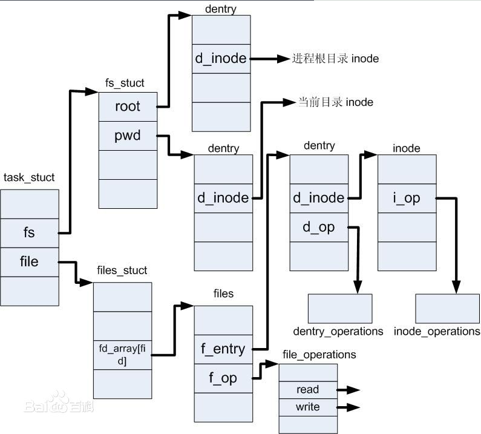

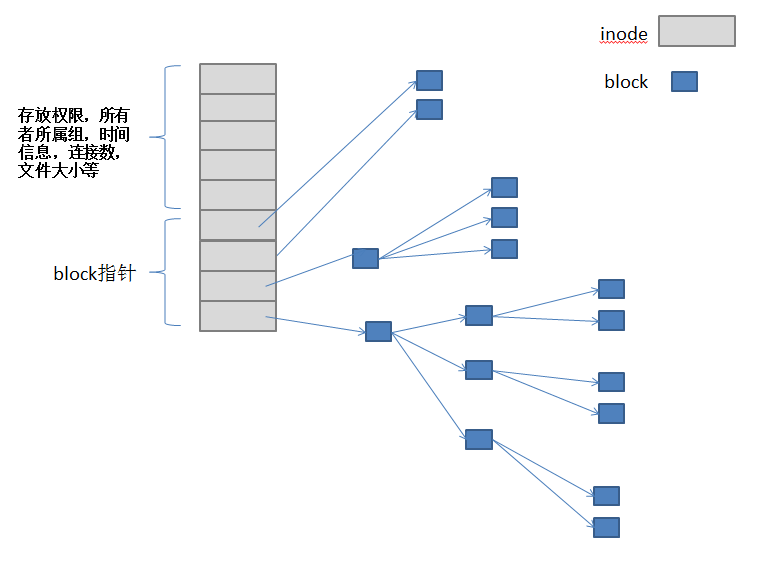

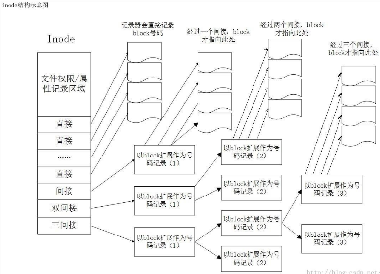

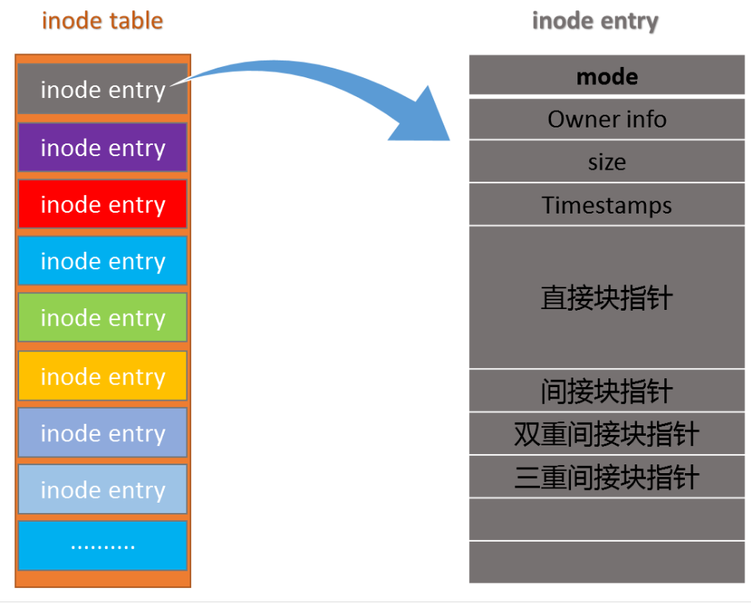

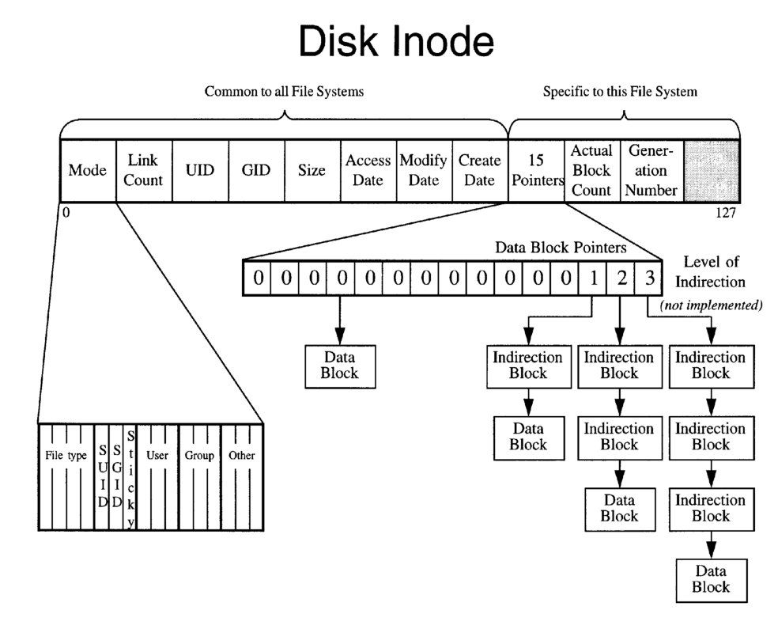

* inode 是 UNIX 操作系统中的一种数据结构，其本质是结构体，它包含了与文件系统中各个文件相关的一些重要信息。在 UNIX 中创建文件系统时，同时将会创建大量的 inode 。通常，文件系统磁盘空间中大约百分之一空间分配给了 inode 表。

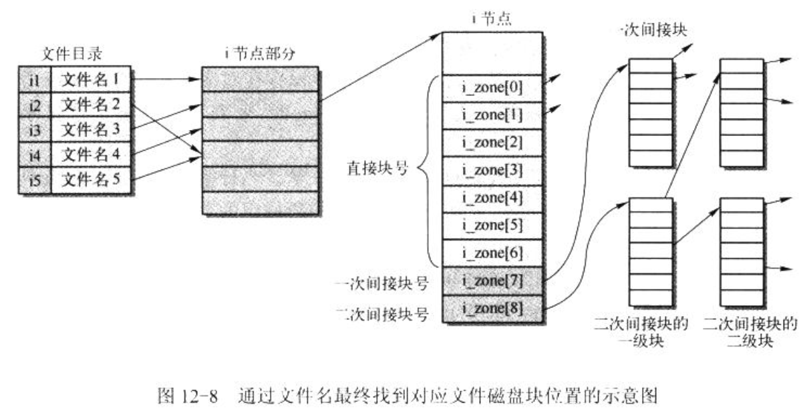

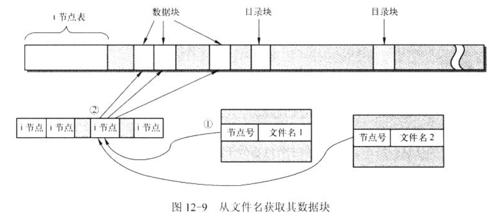

* 硬连接不可跨文件系统且不能为目录创建硬链接。软连接就很随意。

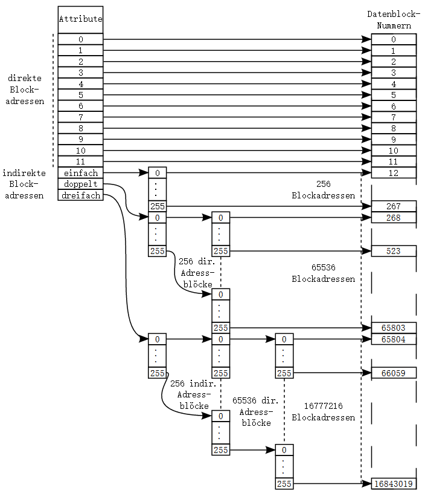

## 高速缓冲(磁盘高速缓冲)

* 缓解CPU与外设速率不匹配的情况

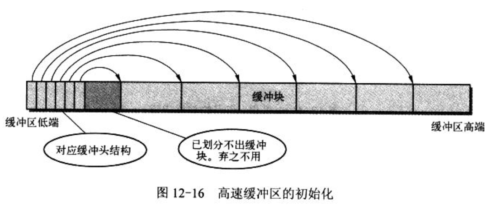

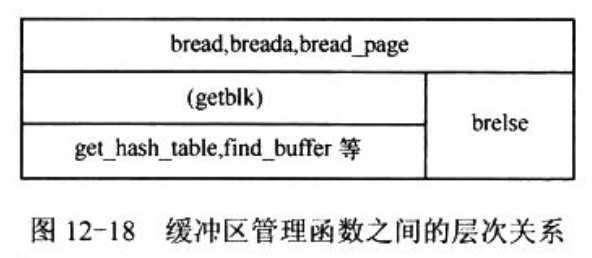

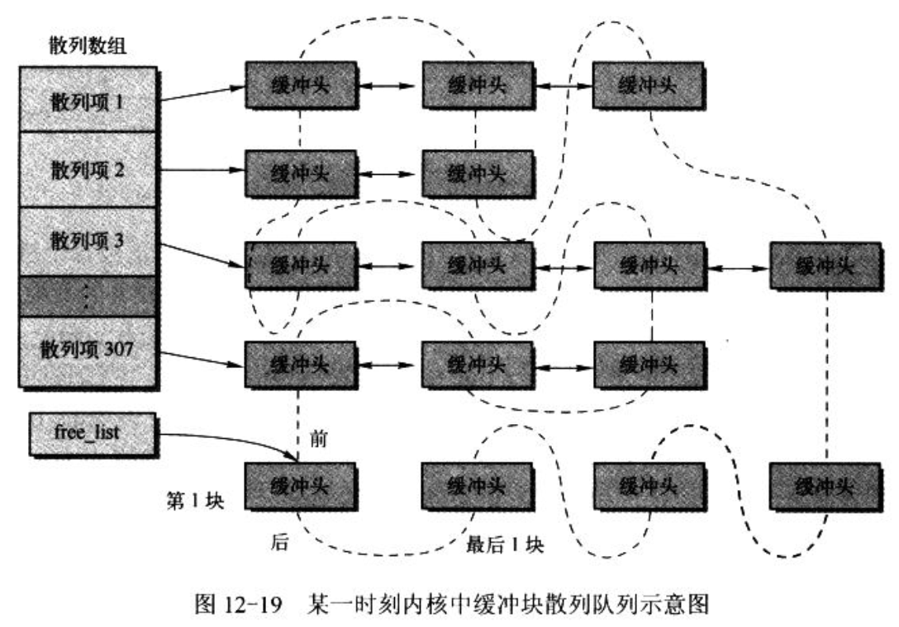

## 文件底层操作

## 文件数据访问

## 文件高层访问

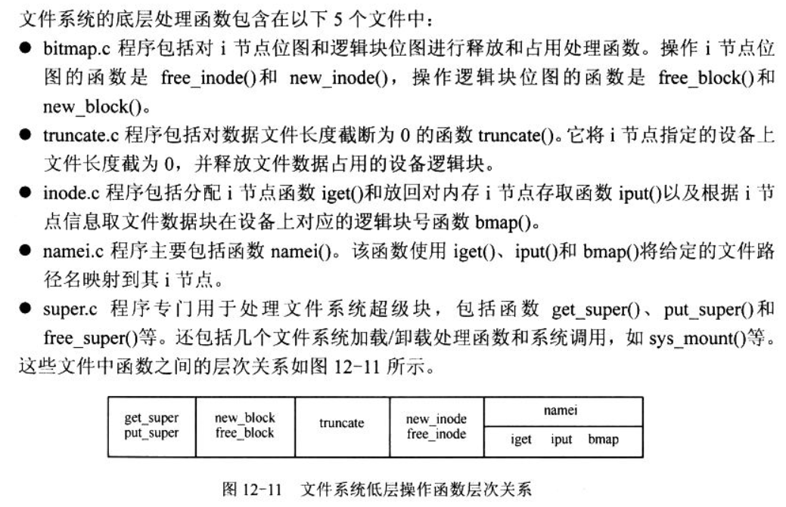

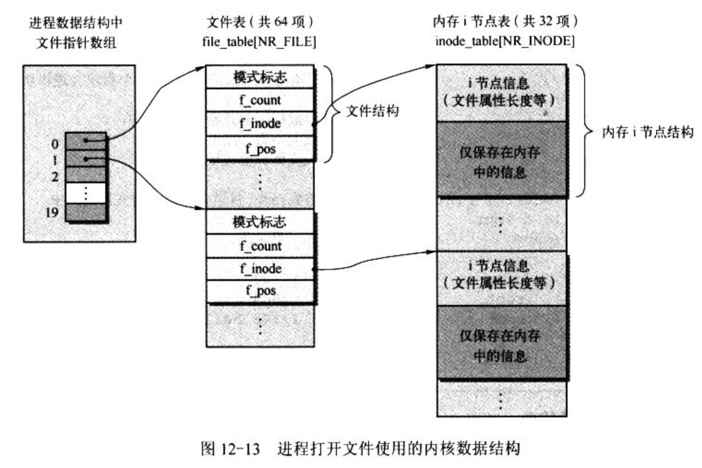

## END
